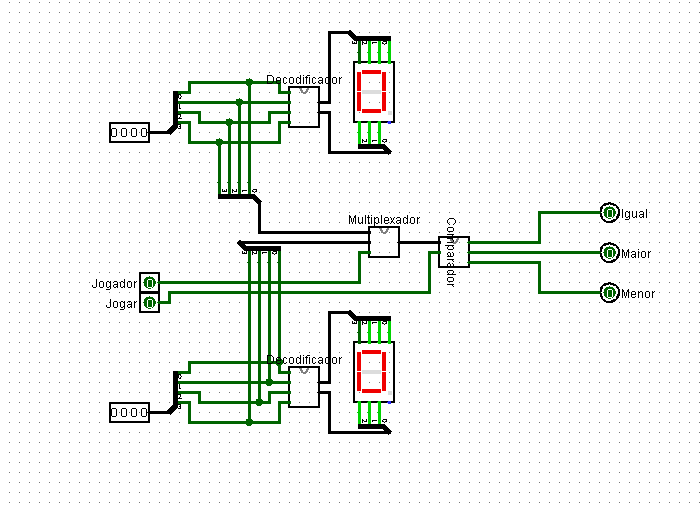
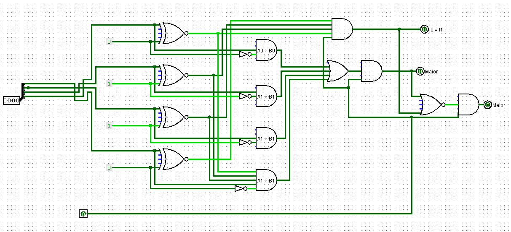

# Guess The Number 

# 1. Introdução
  O projeto Guess the Number é um programa feito com circuitos digitais onde dois jogadores tentam acertar um numero secreto pré estabelecido. Como resultado da tentativa há uma saida que diz se o palpite é igual, maior ou menor do que o "numero secreto".
  

# 2. Multiplexador
  O circuito do multiplexador controla o jogador que está dando o palpite, tendo duas entradas de 4 bits (para o palpite) e uma de 1 bit (para controlar o jogador, 0 ou 1).

# 3. Decodificador
  A função do decodificador é mostrar no display de sete seguimentos o valor digitado (em binario) ser mostrado em hexadecimal. Para isso, foi feito para cada pino um circuito com o auxilio do mapa de VK (confira as fotos na pasta imagens).

  Com os circuitos feitos, basta conectar as quatro entradas de 1 bit nas entradas dos ciruitos e a saida deles no respectivas saidas do decodificador.
  

# 4. Comparador
  Neste circuito, recebe-se as quatro entradas do palpite do jogador e as quatro do "numero secreto", para cada uma das saidas temos uma configuração:
  
    a) Para igualdade: quatro portas XNOR com duas entradas, mesmas entradas do "numero secreto" e do palpite, dessa forma, caso sejam iguais, a saida será verdadeira. Após isso há uma AND para as quatro portas XNOR.
    b) Para maior: para comparar a magnitude, se começa onlhando pelo bit de maior significancia (A3>B3) e assim posteriormente.
    c) Para menor: após verificar as demais condições, se estas forem falsa é porque o palpite é menor do que o "numero secreto".

  
